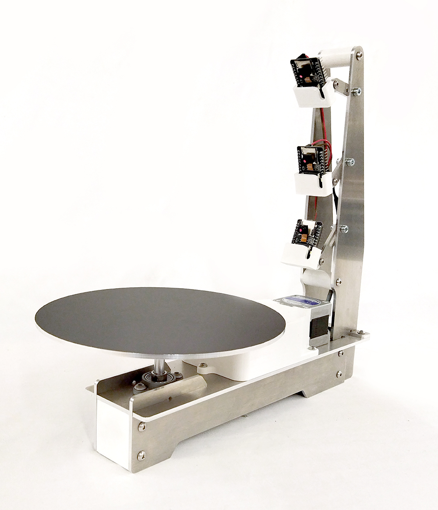
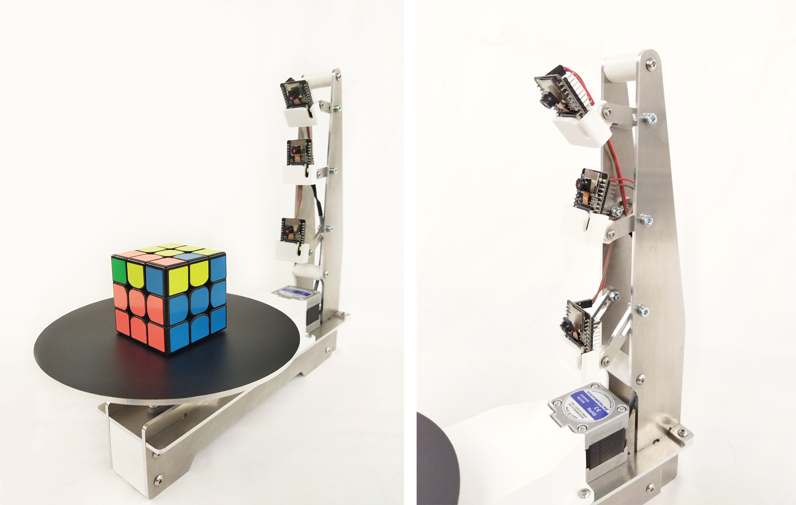

<div align="center"><h1 style=align="center">OLSK 3D Scanner V1</h1></div>

<div align="center"></div>
<div align="center"><i>Open Source 3D Scanner - Open Lab Starter Kit</i></div>

<br>

Introduction
--

The OLSK 3D Scanner is an open source 3D scanner with turntable and 3 cameras for a faster caption of the 3D model. With a very simple and compact design, this machine can be easily replicable and assembled in Fab Labs, schools or at home. The user can process and save the model online, removing the need of transfering the file by USB stick or connecting via cable. The position of the cameras can be adjusted according to the size and shape of the object to be scanned. 



Results
--


Specifications V1
--

- cameras: 3 x ESP32 Cam modules
- frame: 3mm CNC milled aluminum
- motion: GT2 10mm belt
- motors: stepper motor NEMA 17

Warning
--

Although we were able to obtain some successful 3d scans, at the end the cameras broke due to overheating. 

For the scanner in order to obtain the pictures for the photogrammetry process, we use 3 “ESP32- CAM AI-Thinker” modules, this module comes with stock OV2640 cameras that lacks both the resolution and autofocus capabilities needed in order for the process to work, That is why we replaced this stock cameras with the OV5640 model upgrading from 2MP to 5MP and adding the already mentioned autofocus feature. Unfortunately, even with custom made heatsinks, after some successful scans, the cameras overheated and broke. 

The results made clear that better heat dissipation is needed (maybe active cooling) or we should find a more efficient camera module replacement that is equal or more capable.

Software
--
- Triceptor: Recieve images from the three cameras and controlling the table of the 3d scanner.

- esp32Cam: Stream camera via wifi.
- esp32MainBoard: Controller to move the OLSK-3D-Scanner.

## Setup
Change wifi name and password in esp32Cam:

```
const char* ssid = "WIFI NAME";
const char* password = "1234";
```

Files
--

- **[CAD](cad)**
- **[Program](https://github.com/Open-Lab-Starter-Kit/OLSK-3D-Scanner/tree/main/program)**
- **[BOM](BOM)**
- **[PCB](PCB)**
- **[Wiring Schematic](3D_Scanner_V1_WiringSchematic.pdf)**

Author
--

OLSK 3D Scanner has been designed and built by **[InMachines Ingrassia GmbH](https://www.inmachines.net/)**.


<br>

Machine design:
- **[Wilhelm Schütze](http://fabacademy.org/archives/2015/sa/students/schutze.wilhelm/index.html)**
- **[Alberto Porri](http://fabacademy.org/2021/labs/santachiara/students/alberto-porri/)**

Software design:
- **[Marcello Tania](https://marcellotania.com/)**

The machine is part of the **[Open Lab Starter Kit (OLSK)](https://www.inmachines.net/open-lab-starter-kit)** group of open source digital fabrication machines.

OLSK is developed by **[InMachines Ingrassia GmbH](https://www.inmachines.net/)** for the **[Dtec project](https://dtecbw.de/home/forschung/hsu/projekt-fabcity)** at **[Fab City Hamburg](https://www.fabcity.hamburg/en/)**.

OLSK Partners:
<br><br>


Contact
--

- daniele@inmachines.net
- [https://www.inmachines.net/](https://www.inmachines.net/)

License
--

Hardware design, CAD and PCB files, BOM, settings and other technical or design files are released under the following license:

- CERN Open Hardware Licence Version 2 Weakly Reciprocal - **[CERN-OHL-W](LICENSE_CERN_OHL_W_V2.txt)**

Assembly manual, pictures, videos, presentations, description text and other type of media are released under the following license:

- Creative-Commons-Attribution-ShareAlike 4.0 International - **[CC BY-SA 4.0](LICENSE_CC_BY_SA_4.0.txt)**
