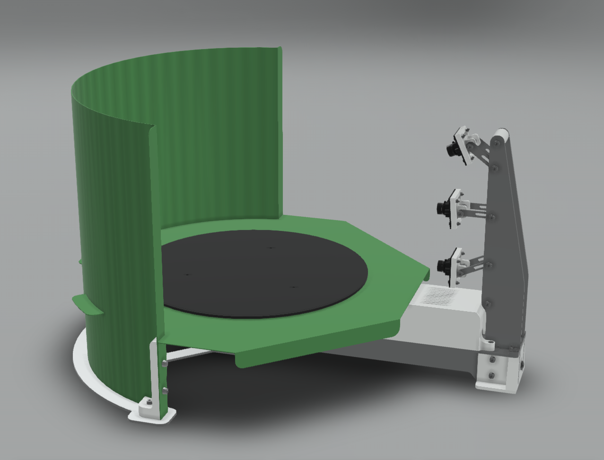
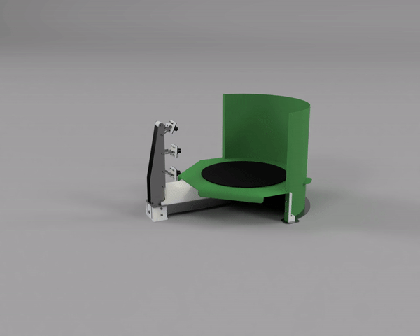
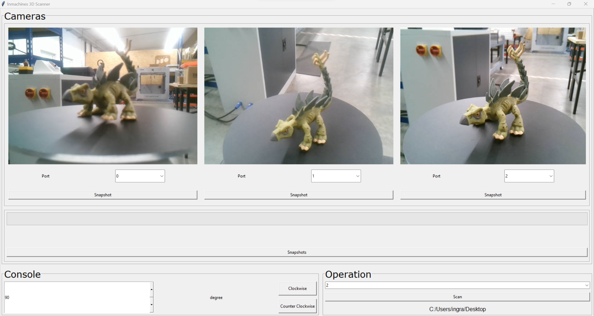

<h1 style=align="center">OLSK 3D Scanner V2</h1>

<i>Open Source 3D Scanner - Open Lab Starter Kit</i>

 

Introduction
--

The OLSK 3D Scanner is an open source 3D scanner with turntable and 3 cameras for a faster caption of the 3D model. With a very simple and compact design, this machine can be easily replicable and assembled in Fab Labs, schools or at home. Using a USB cable, the user can connect to the 3D Scanner and process the model using a custom software. The position of the cameras can be adjusted according to the size and shape of the object to be scanned. 

Specifications V2
--

- cameras: 3 x USB modules with a Sony IMX179 sensor, with autofocus
- frame: 3mm CNC milled aluminum
- motion: GT2 10mm belt
- motors: stepper motor NEMA 17

Software
--
- Laptop side: Receives images from the three cameras and controls the table of the 3d scanner.
- PCB side: Controller to move the OLSK-3D-Scanner.

Files
--

- **[CAD](cad)**
- **[Software](Software)**
- **[BOM](BOM)**

Author
--

OLSK 3D Scanner has been designed and built by **[InMachines Ingrassia GmbH](https://www.inmachines.net/)**.

 

Machine design:
- **[Wilhelm Schütze](http://fabacademy.org/archives/2015/sa/students/schutze.wilhelm/index.html)**
- **[Alberto Porri](http://fabacademy.org/2021/labs/santachiara/students/alberto-porri/)**

Software design:
- **[Marcello Tania](https://marcellotania.com/)**
- **[Sulaiman Tanbari](https://www.linkedin.com/in/mohammad-sulaiman-tanbari/)**

The machine is part of the **[Open Lab Starter Kit (OLSK)](https://www.inmachines.net/open-lab-starter-kit)** group of open source digital fabrication machines.

OLSK is developed by **[InMachines Ingrassia GmbH](https://www.inmachines.net/)** for the **[Dtec project](https://dtecbw.de/home/forschung/hsu/projekt-fabcity)** at **[Fab City Hamburg](https://www.fabcity.hamburg/en/)**.

OLSK Partners:
  

Contact
--

- daniele@inmachines.net
- [https://www.inmachines.net/](https://www.inmachines.net/)

License
--

Hardware design, CAD and PCB files, BOM, settings and other technical or design files are released under the following license:

- CERN Open Hardware Licence Version 2 Weakly Reciprocal - **[CERN-OHL-W](LICENSE_CERN_OHL_W_V2.txt)**

Assembly manual, pictures, videos, presentations, description text and other type of media are released under the following license:

- Creative-Commons-Attribution-ShareAlike 4.0 International - **[CC BY-SA 4.0](LICENSE_CC_BY_SA_4.0.txt)**
