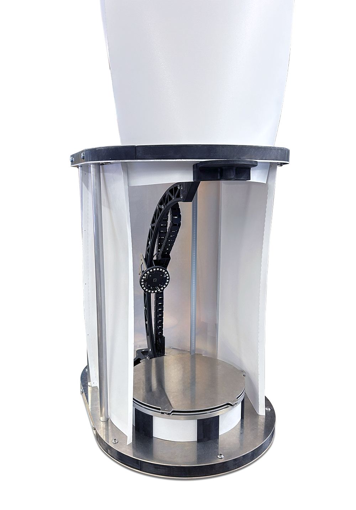
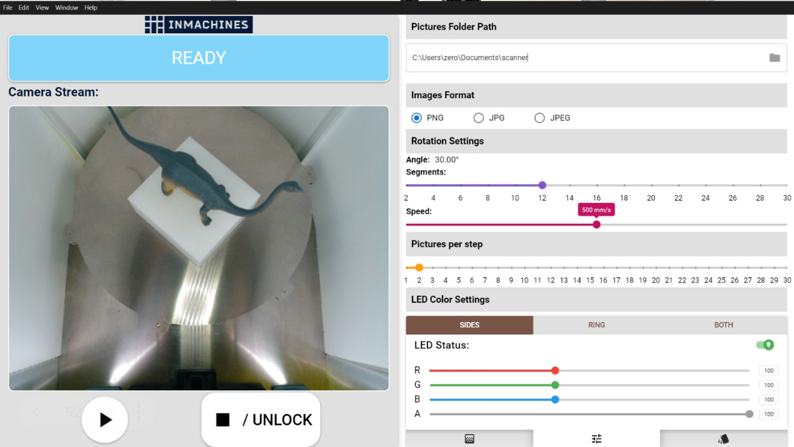
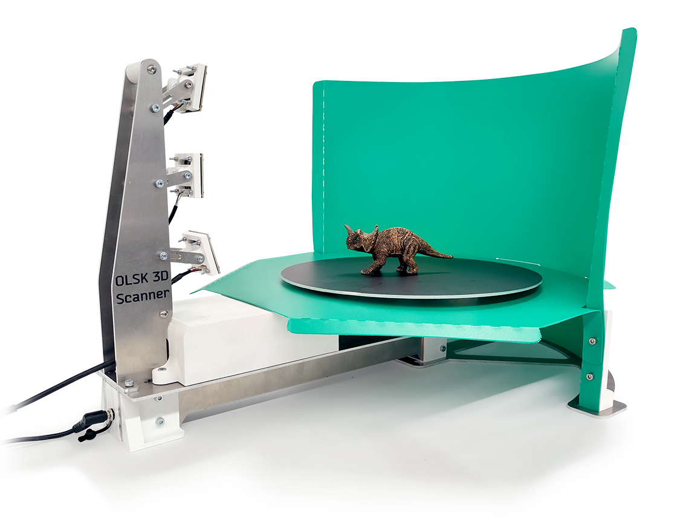
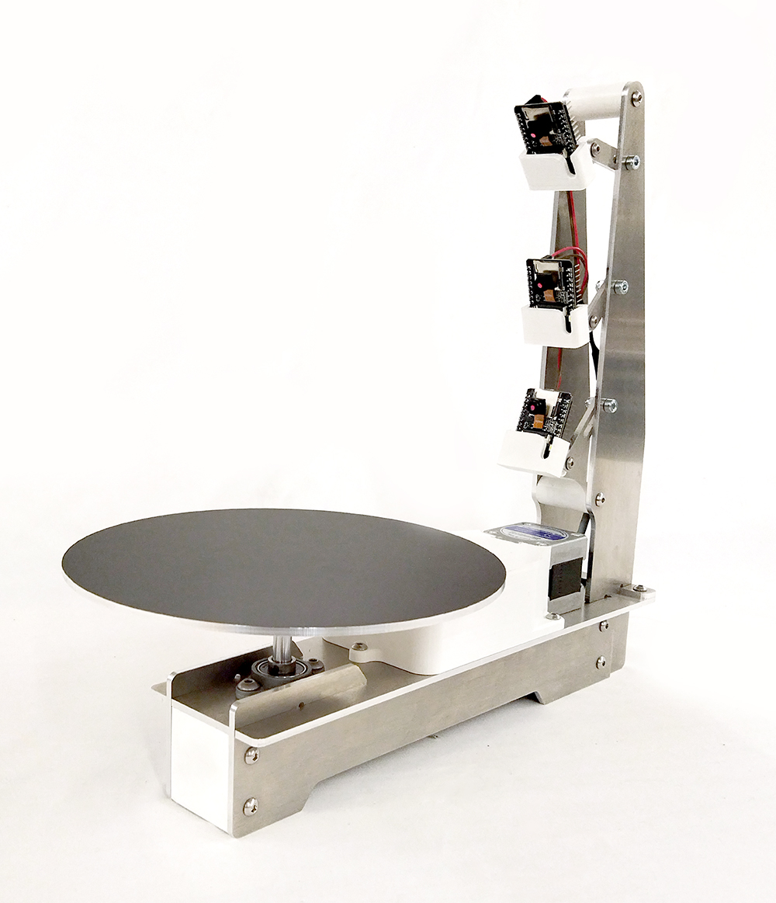

<h1 style=align="center">OLSK 3D Scanner V3</h1>

<i>Open Source 3D Scanner - Open Lab Starter Kit</i>

 

Introduction
--

The OLSK 3D Scanner is an open-source 3D scanner with turntable and one moving camera. It features a closed environment for a better caption of the model. With a very simple and compact design, this machine can be easily replicable and assembled in Fab Labs, schools or at home. 

The Assembly Manual
--

All OLSK machines are open source and have an assembly manual, the BOM and necessary files available in this repository for replication. The assembly manual is an interactive 3D guide though each step and contains a list of parts, tools and instruction remarks, which follows a logical order to provide a smooth assembly.

- **[Assembly Manual](https://open-lab-starter-kit.github.io/OLSK-3D-Scanner/)**

 

Specifications V3
--

- motion: combination of arc and rotation
- lights: 2x adjustable LED lights
- image capturing: adjustable number of pictures per rotation and pictures per arc travel
- software: app (compatible with any OS)
- housing: fully enclosed
- images saved directly on PC

Files
--

- **[CAD](cad)**
- **[Firmware](firmware)**
- **[Wiring Schematic](OLSK_3D_Scanner_V3_WiringSchematic.pdf)**
- **[BOM](OLSK_3D_Scanner_V3-BOM.xlsx)**

Author
--

OLSK 3D Scanner has been designed and built by **[InMachines Ingrassia GmbH](https://www.inmachines.net/)**.

 

Machine design:
- **[Wilhelm Schütze](http://fabacademy.org/archives/2015/sa/students/schutze.wilhelm/index.html)**
- **[Alberto Porri](http://fabacademy.org/2021/labs/santachiara/students/alberto-porri/)**

Software design:
- **[Sulaiman Tanbari](https://www.linkedin.com/in/mohammad-sulaiman-tanbari/)**
- **[Daniele Ingrassia](https://www.linkedin.com/in/danieleingrassia/)**

The machine is part of the **[Open Lab Starter Kit (OLSK)](https://www.inmachines.net/open-lab-starter-kit)** group of open source digital fabrication machines.

OLSK is developed by **[InMachines Ingrassia GmbH](https://www.inmachines.net/)** for the **[Dtec project](https://dtecbw.de/home/forschung/hsu/projekt-fabcity)** at **[Fab City Hamburg](https://www.fabcity.hamburg/en/)**.

OLSK Partners:
  

Contact
--

- daniele@inmachines.net
- [https://www.inmachines.net/](https://www.inmachines.net/)

License
--

Hardware design, CAD and PCB files, BOM, settings and other technical or design files are released under the following license:

- CERN Open Hardware Licence Version 2 Weakly Reciprocal - **[CERN-OHL-W](LICENSE_CERN_OHL_W_V2.txt)**

Assembly manual, pictures, videos, presentations, description text and other type of media are released under the following license:

- Creative-Commons-Attribution-ShareAlike 4.0 International - **[CC BY-SA 4.0](LICENSE_CC_BY_SA_4.0.txt)**

Previous version
--

The previous versions of OLSK machines will always be available. 

**[OLSK 3D Scanner V2 Repository](OLSK_3D_Scanner_V2)** 

**[OLSK 3D Scanner V1 Repository](OLSK_3D_Scanner_V1)** 

